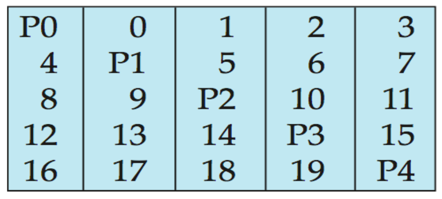

<!-- layout: true -->

<!-- class: middle -->

---

<!-- class: center, middle, inverse -->

# RAID

## Redundant Arrays of Inexpensive/Independent Disks

.right[

  .invisible-slide-comment[See [^dot_right] about `.right`]

  Presented by Huanyi Chen

  huanyi.chen@uwaterloo.ca

]

---

## Why do we need RAID?

--

- It can increase *capacity* and *speed* by using multiple disks in parallel
  - *capacity*: a RAID array with more than two drives will have an effective
    capacity larger than a single disk
  - *speed*: performance can be improved via parallelism

- It increases *reliability* through *redundancy*, ensuring survival of data if
  a (small enough) subset of disks fails

> *E.g.*, a system with 100 disks, each with a mean time between failures (MTBF)
> of 100,000 hours (approx. 11 years), will have a system MTBF of 1,000 hours
> (approx. 42 days).

???

.invisible-slide-comment[See [^triple_question_marks] about `???`]

RAID is *a disk organization technique* that uses multiple physical disks to
provide the illusion of a single more reliable and/or more performant disk.

---

## Redundancy

- Store extra information that can be used to rebuild information lost in a disk
  failure.
  - Mirroring
  - Parity bits

## Reliability

- A measure of how (in)frequently failures occur

- Unit: mean time to data loss
  - depends on the mean time between failures (MTBF)
  - and depends on the mean time to repair

  > *E.g.*, MTBF of 100,000 hours, mean time to repair of 10 hours gives mean
  > time to data loss of $500*10^6$ hours (or 57,000 years) for a mirrored pair of
  > disks (assuming independent failures).

???

.invisible-slide-comment[See [^triple_question_marks] about `???`]

Considering a mirrored pair of disks, the mean time to data loss is
100000^2 / (2 * 10) = 500 * 10^6. 500 * 10^ / 8760 (days in a calendar year) = ~57000 years.

The original paper of RAID, https://ntrs.nasa.gov/api/citations/19920010046/downloads/19920010046.pdf, shows the derivation, which is modelled via a Markov chain model.

The simplified formula can be shown as such:

MTTDL_Indep = MTTF_disk^2 / (N(N+1)(MTTR_disk))

As we showed above, the MTTF is 10000 hours and there are 2 disks, which is N + 1, thus N = 1. The MTTR is 10 hours.

---

## Improvement in Performance via Parallelism

Two main goals of parallelism in a disk system:

- Increasing throughput by distributing small I/O requests across multiple disks
- Reducing response time by parallelizing large I/O requests

The dominant technique for parallelizing I/O is **striping**.

Practical systems generally use **block-level striping**.

---

## RAID 10 (RAID Level 1+0)

- Two copies of everything
- Block striping
- How to recover: copy from mirror

???

.invisible-slide-comment[See [^triple_question_marks] about `???`]

People call it RAID "ten" but it seems to be more accurate to call it RAID "one
zero".

---

## RAID 10 (continued)

Assume we have 8 disks in total

When performing

- Many small random reads; or
- One large read

The throughput is up to 8x better than using one disk (No penalty).

When performing

- Many small random writes; or
- One large write

The throughput is up to 4x better than using one disk (2x penalty since each
logical I/O needs two physical I/Os).

---

## RAID 5 (RAID Level 5)

- Block-interleaved distributed parity
- Partitions data and parity among $N + 1$ disks ($N > 2$)
- How to recover: reading $N$ remaining disks to reconstruct the failed block

---

## RAID 5 (continued)

Assume we have 5 disks in total

- Many small random reads
  - The throughput is up to 5x better than using one disk (No penalty)

- A large read
  - Since we have to skip over the parity blocks, so in this case we can
    estimate the large read throughput as 4x better than one disk because if we
    read all five disks in parallel then 4/5 of the blocks are data and 1/5 are
    parity.

---

## RAID 5 (continued)

Assume we have 5 disks in total

- Many small random writes
  - Since there are four physical I/Os for every logical I/O (that's how the
    parity calculation works), therefore the small write throughput is up to
    (5/4)x better than using one disk. (4x penalty)

- A large write
  - Since we have to write parity blocks, so in this case we can estimate the
    large write throughput as 4x better than one disk because if we write all
    five disks in parallel then 4/5 of the blocks are data and 1/5 are parity.

???

.invisible-slide-comment[See [^triple_question_marks] about `???`]

Why are there four physical I/Os for a small write?

Answer: it seems to be how it was designed, as stated here
<https://en.wikipedia.org/wiki/Standard_RAID_levels#RAID_5>

> *In the worst case when a single, logical sector is to be written, the
> original sector and the according parity sector need to be read, the original
> data is removed from the parity, the new data calculated into the parity and
> both the new data sector and the new parity sector are written.*

---

# Practice Questions

A RAID system is being constructed using 10 identical 1TB hard disks. The raw
storage capacity of this system is exactly 10TB. Each disk individually is able
to read or write 100MB/s.

Suppose that we want to access a single 100GB file using the RAID system.
Estimate how many seconds it takes to:

1. Write the entire file once if RAID 5 is used

1. Read the entire file once if RAID 10 is used and one disk has failed

*(write down the formula and plug in numbers but do not simplify)*

???

.invisible-slide-comment[See [^triple_question_marks] about `???`]

For the first question, there is a 9x speed-up if we write all 10 disks in
parallel. (For each stripe, 9 disks receive data and 1 receives parity.)

Formula: 100GB / (9 disks * 100MB/s/disk)

For the second question, it is limited by the mirrored pair containing the
failed disk.

Formula: 100GB * (1/5 of the data per mirrored pair) / (100MB/s/disk)

---

## Practice Questions (continued)

A RAID system is constructed using 8 identical 1TB hard disks. The raw storage
capacity of this system is exactly 8TB. Each disk individually is able to read
or write 100MB/s.

Suppose that we want to access a single 100GB file using the RAID system.
Estimate how many seconds it takes to:

1. Read the entire file once if RAID 5 is used

1. Write the entire file once if RAID 10 is used and one disk has failed

*(write down the formula and plug in numbers but do not simplify)*

???

.invisible-slide-comment[See [^triple_question_marks] about `???`]

For the first question, there is a 7x speed-up if we read all 8 disks in
parallel. (For each stripe, 7 disks return data and 1 returns parity.)

Formula: 100GB / (7 disks * 100MB/s/disk)

For the second question, the write time is unaffected by the failed disk since
all disks have to be written anyway.

Formula: 100GB / (4 mirrored pairs * 100MB/s/disk)

---

Content is based on part09 of the lecture slides

.invisible-slide-comment[

See all footnotes below.

[^dot_right]: `.right` is a syntax to align slide content to the right and can
be ignored when reading the .md source

[^triple_question_marks]: `???` is a syntax used for slide show and can be
ignored when reading the .md source. It states that the content after `???` is
only visible in the presenter mode.

]
